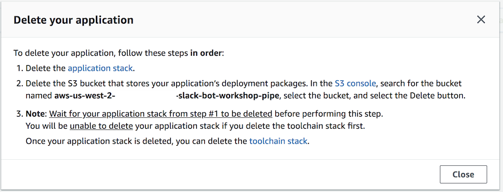

# Workshop Cleanup

This page provides instructions for cleaning up the resources created during the preceding modules. To clean up the AWS account after this workshop, you will need to remove all resources that were created for you. Note that the order of operations is important.

## Resource Cleanup Instructions

### 1. Remove the application
Remove the serverless application and the CI/CD pipeline created for managing it.

**:white_check_mark: Step-by-step directions**

1. In the [Lambda Console][lambda-console] Go to the **Applications** page.
1. Select the radio button next to your application.
1. Choose **Actions** and then **Delete**.
1. A pop-up with links will appear. **Note** that you must do one extra operation between steps 2 and 3 to successfully complete the deletion! Continue to step 5 below for detailed instructions.

    

1. Perform step 1: **Delete the application stack**. When you click the **application stack** link, the [CloudFormation console][cfn-console] will open in a new tab. Choose **Delete** and confirm. Note that the page will **not** automatically refresh. Click the refresh button in the **Overview** section to verify if the process is complete.
1. Perform step 2: **Delete the S3 bucket**. When you click the [S3 console][s3-console] link, search for the bucket name, select the checkbox, choose **Delete**, and confirm.
1. Go back to the Applications in the [Lambda Console][lambda-console] and close the pop-up.
1. Click on your application name to open it.
1. Choose **CloudFormationRole** to open it in the IAM console.
1. Under **Permissions policies**, choose the **X** next to the **SNSFullAccess**, **IAMFullAccess**, and **CloudWatchFullAccess** policies to detach them. Confirm detachment in the pop-up message. Do **not** detach the **WorkerCloudFormationRolePolicy** policy.

    
1. Go back to the **Applications** page in the [Lambda Console][lambda-console].
1. Select the radio button next to your application.
1. Choose **Actions** and then **Delete**.
1. Perform step 3: **Delete the toolchain stack**. When you click the **toolchain stack** link, the CloudFormation console will open. Choose **Delete** and confirm. Note that the page will **not** automatically refresh. Click the refresh button in the **Overview** section to verify if the process is complete.
1. After completing step 3, refresh the **Applications** page to confirm if the application has been deleted.

### 2. Remove CodeCommit credentials
Remove the credentials used to access CodeCommit repositories, unless you will use them again in the future.

**:white_check_mark: Step-by-step directions**

1. Go to the [IAM Console][iam-console].
1. Choose **Users** in the left menu.
1. Find the user you created in the AWS CodeCommit credentials step.
1. Select the checkbox next to the user name and choose **Delete user**.
1. Confirm deletion in the pop-up form.

### 3. Remove AWS Chatbot configuration and role
Remove the AWS Chatbot that you configured today and delete the role created with it.

**:white_check_mark: Step-by-step directions**

1. Go to the [AWS Chatbot console][chatbot-console]
1. Choose your Slack workspace in the **Configured clients** list.
1. Click the name of the Slack channel you configured for notifications. A **Slack channel details** page will open.
1. Under **IAM role**, click the role name.

    

1. [IAM Console][iam-console] will open in a new tab. Choose **Delete role** and confirm.
1. Return to the [AWS Chatbot console][chatbot-console] and go back to the **Slack workspace** page.
1. Select the radio button next to the Slack channel you used for Chatbot notifications and choose **Delete channel**. Note that this action does not delete the Slack channel itself - it only removes the AWS Chatbot configuration for the channel.
1. Confirm deletion in the pop-up message.
1. Choose **Remove workspace configuration** and confirm deletion in the pop-up form.

### 4. Remove the Slack app
Remove the Slack application from your Slack account

**:white_check_mark: Step-by-step directions**

1. Go to the [api.slack.com][api-slack] dashboard.
1. Choose **Your Apps**.
1. Choose the Slack app you've created.
1. Scroll to the bottom of the page and choose **Delete App**. Confirm deletion.

---

This marks completion of the workshop.

[iam-console]: https://console.aws.amazon.com/iam/home
[lambda-console]: https://console.aws.amazon.com/lambda/home
[cfn-console]: https://console.aws.amazon.com/cloudformation/home
[s3-console]: https://console.aws.amazon.com/s3/home
[chatbot-console]: https://console.aws.amazon.com/chatbot/home
[api-slack]: https://api.slack.com

