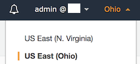
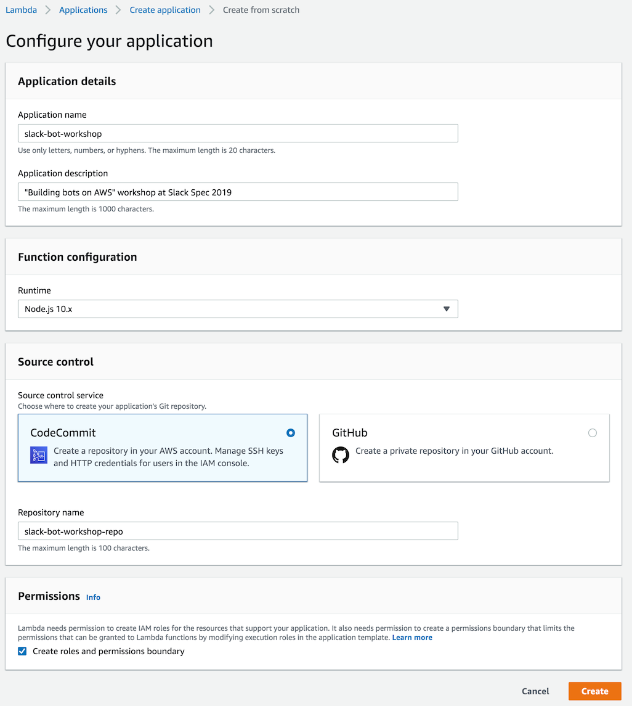
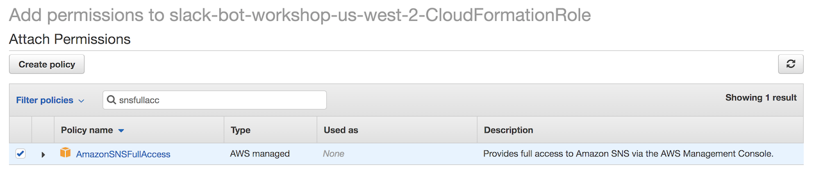

# Module 1: Create a serverless application

In this step, you will create a Serverless Application that uses Amazon API Gateway and AWS Lambda to receive and process events. The infrastructure will be orchestrated by an automatically created CI/CD pipeline. You will then extend the default IAM role created so that you can work with additional services later on.

## Implementation Instructions

:heavy_exclamation_mark: Ensure you've completed the [setup guide][setup] before beginning
the workshop.

Each of the following sections provides an implementation overview and detailed, step-by-step instructions. The overview should provide enough context for you to complete the implementation if you're already familiar with the AWS Management Console or you want to explore the services yourself without following a walkthrough.

### 1. Create the AWS Lambda based serverless application
In the Lambda console, create a new serverless application from scratch. Wait until the creation completes.

**:white_check_mark: Step-by-step directions**

1. Go to the [AWS Console][aws-console] and log in to your AWS account.
1. Choose the **US East (Ohio)** region in the navigation bar.

    

1. Go to the [Lambda Console][lambda-console].
1. In the Lambda console, choose **Applications** in the sidebar on the left.
1. Choose **Create application**.
1. Choose **Author from scratch** at the bottom of the page.
1. Give the application a name and description, choose **Node.JS 10.x** runtime and **CodeCommit** as the source control service. Give the repository a name. Check the **Create roles and permissions boundary** checkbox. Choose **Create**.

    

1. Wait for the creation process to finish. This will take approximately 5 minutes and you will see a success message when it's complete.

---

Creation of infrastructure for the application is done by AWS CloudFormation, a service that enables managing infrastructure as code (IaC). CloudFormation uses an Identity and Access Management (IAM) role to create resources in your account. The default role created by the Serverless Application template does not have sufficient permissions to create resources in CloudWatch, SNS and IAM that you will need for this workshop. In this step, you will manually add the necessary permissions.

### 2. Modify CloudFormation role
Open the CloudFormationRole IAM role in IAM console and add SNSFullAccess, IAMFullAccess, and CloudWatchFullAccess policies to it.

**:white_check_mark: Step-by-step directions**

1. In the Application page, choose **CloudFormationRole** under the **Infrastructure** section. [IAM Console][iam-console] will open in a new tab.
1. Choose **Attach policies**.
1. Search for **SNSFullAccess** and select it (but do not attach it yet). Repeat for **IAMFullAccess** and **CloudWatchFullAccess**.
    
    

1. Choose **Attach policy** to attach the three selected policies to the role.

### :star: Recap

:wrench: The AWS Lambda "Create Application" flow gives you a full CI/CD setup to support building and deploying your serverless application. In just a few clicks you were able to establish a full code pipeline that automates from commit to deploy of a serverless app.

### Next

:white_check_mark: Proceed to the next module, [Code Management][code-management], 
wherein you'll configure an IAM user to interface with the CodeCommit repository created in this step. You'll then clone it locally and test the pipeline's functionality.

[cognito]: https://aws.amazon.com/cognito/
[lambda]: https://aws.amazon.com/lambda/
[api-gw]: https://aws.amazon.com/api-gateway/
[s3]: https://aws.amazon.com/s3/
[dynamodb]: https://aws.amazon.com/dynamodb/
[secrets-manager]: https://aws.amazon.com/secrets-manager/
[sns]: https://aws.amazon.com/sns/
[cloudwatch]: https://aws.amazon.com/cloudwatch/
[chatbot]: https://aws.amazon.com/chatbot/
[aws-sam]: https://aws.amazon.com/serverless/sam/
[codepipeline]: https://aws.amazon.com/codepipeline/
[codecommit]: https://aws.amazon.com/codecommit/
[codebuild]: https://aws.amazon.com/codebuild/
[cloudformation]: https://aws.amazon.com/cloudformation/
[aws-console]: https://console.aws.amazon.com
[iam-console]: https://console.aws.amazon.com/iam/home
[lambda-console]: https://console.aws.amazon.com/lambda/home
[cfn-console]: https://console.aws.amazon.com/cloudformation/home
[s3-console]: https://console.aws.amazon.com/s3/home
[chatbot-console]: https://console.aws.amazon.com/chatbot/home
[api-slack]: https://api.slack.com

[setup]: ../00_Setup/
[cleanup]: ../01_Cleanup/
[serverless-app-setup]: ../1_ServerlessAppSetup/
[code-management]: ../2_CodeManagement/
[setup-chatbot]: ../3_ChatBot/
[notifications]: ../4_AWSNotifications/