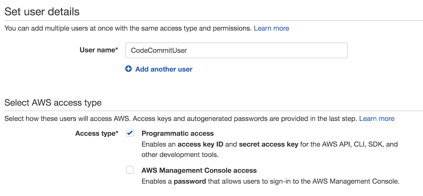
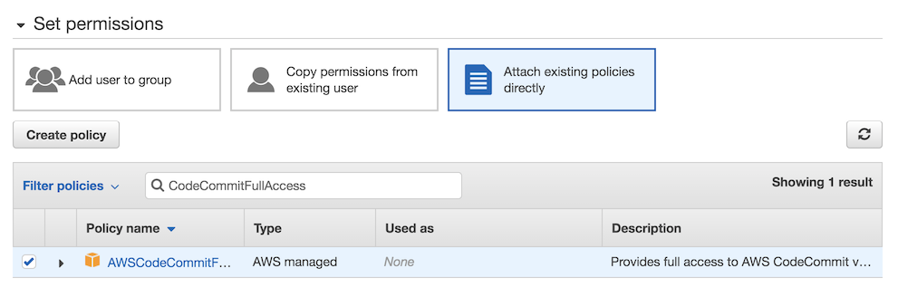
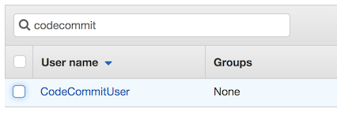
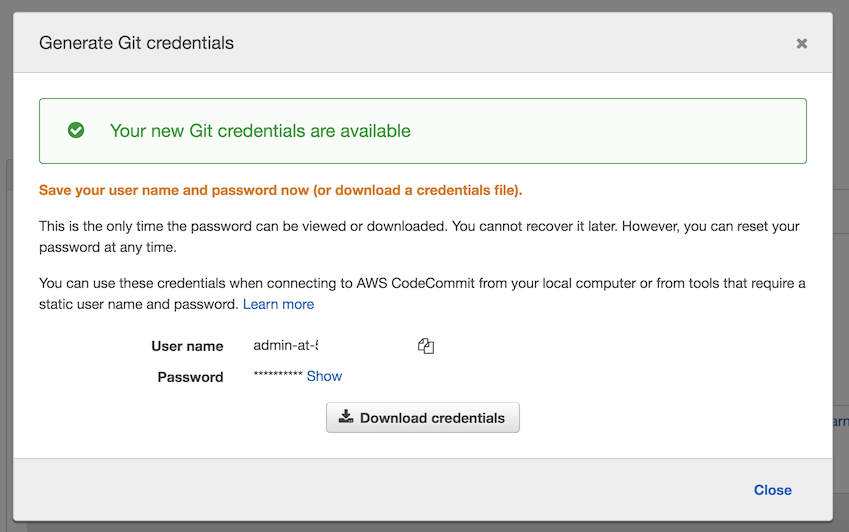
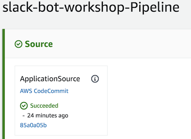

# Module 2: Code management

In this step, you will create an IAM User to interface with the [CodeCommit][codecommit] repository created in the serverless application creation step. You will then clone the repository to your local environment and test commiting back to CodeCommit, which will kick off a [CodePipeline][codepipeline] execution.

## Implementation Instructions

:heavy_exclamation_mark: Ensure you've completed the [Serverless App Setup][serverless-app-setup] before beginning
the workshop.

Each of the following sections provides an implementation overview and detailed, step-by-step instructions. The overview should provide enough context for you to complete the implementation if you're already familiar with the AWS Management Console or you want to explore the services yourself without following a walkthrough.

### 1. Create AWS CodeCommit credentials
Create an IAM user with CodeCommitFullAccess permissions, generate Git credentials and save them to a safe place on your computer.

**:white_check_mark: Step-by-step directions**

1. In the **IAM** console, choose **Users** in the left sidebar.
1. Choose **Add user**.
1. Give the user a name, e.g. **CodeCommitUser** and choose **Programmatic access**.

    

1. Choose **Next: Permissions**
1. Choose **Attach existing policies directly**.
1. Search for **CodeCommitFullAccess** and select the checkbox next to the policy.

    

1. Choose **Next: Tags**.
1. Choose **Next: Review**.
1. Choose **Create user**.
1. Choose **Close**.
1. You will be redirected back to the **Users** page in IAM. Find the user you've just created.

    

1. Click on the user name.
1. Choose the **Security credentials** tab.
1. Under **HTTPS Git credentials for AWS CodeCommit**, choose **Generate Git credentials**.
1. Choose **Download credentials** or save username and password to a safe location on your computer.

    
1. You can close the **IAM** tab now.

---

### 2. Set up a local CodeCommit repository and update the app code

#### Background

In step 1, you created a simple "hello world" application from a template. In this step, you will add the new Serverless Application Model (SAM) template and the slack bot code to the repository. This will create additional AWS resources and deploy the Slack bot code to a Lambda function.

#### High-level instructions

Clone the AWS CodeCommit repository, add a remote branch with the slack bot code, and push the slack bot code to CodeCommit. Verify that the code successfully goes through the pipeline and deploys.

#### Step-by-step directions

1. Go back to the tab with the application you created in step 1.
1. Under the **Infrastructure** section, choose **ProjectPipeline**.
1. **CodePipeline** console will open in a new tab.
1. Choose **AWS CodeCommit** under the **Source** stage.

    

1. The code repository managed by AWS CodeCommit will open in the same tab.
1. Choose **Clone URL** and select **Clone HTTPS** in the dropdown.
1. You can see the clone URL in the success message at the top of the page. The URL has been automatically copied to the clipboard.
1. Open the terminal app on your computer and go to the directory where you want to store the code.
1. Type the following command 
    ```
    git clone <URL>
    ```
1. You will be prompted for a user name and password. Use the CodeCommit credentials you saved in step 2.

    **If you got an error**: If you've previously configured aws credential helper for git, you may get a "repository not found" error. You will need to remove or comment (with a `#`) the following line in .gitconfig file (`~/.gitconfig` on Mac/Linux, `C:\Users\<USER>\.gitconfig` on Windows):
    ```
    helper = !aws --global codecommit credential-helper $@
    ```
1. Run the following commands in the terminal to get the Slack bot code added to your code repository.
    ```
    cd <NAME-OF-REPOSITORY>
    git remote add gh-origin https://github.com/aws-samples/building-bots-on-aws.git
    git fetch gh-origin
    git merge gh-origin/master --strategy-option theirs --allow-unrelated-histories -m "Merge from github"
    git push origin master
    ```
1. Go back to application tab in the AWS Console and choose **ProjectPipeline**.
1. **CodePipeline** console will open a new tab. Watch the code go through the pipeline until all three stages (Source, Build, Deploy) succeed. This will take about 5-7 minutes.

    

### :star: Recap

:wrench: IAM gives you fine grained controls over who and what can access resources in your account. You just used IAM to create a user with access to CodeCommit which is a source version control service based on git. After that you set up the local credentially helper and tested your access.

### Next

:white_check_mark: Proceed to the next module, [Chatbot Setup][setup-chatbot], 
wherein you'll configure an AWS Chatbot bot to connect to Slack.

---
[cognito]: https://aws.amazon.com/cognito/
[lambda]: https://aws.amazon.com/lambda/
[api-gw]: https://aws.amazon.com/api-gateway/
[s3]: https://aws.amazon.com/s3/
[dynamodb]: https://aws.amazon.com/dynamodb/
[secrets-manager]: https://aws.amazon.com/secrets-manager/
[sns]: https://aws.amazon.com/sns/
[cloudwatch]: https://aws.amazon.com/cloudwatch/
[chatbot]: https://aws.amazon.com/chatbot/
[aws-sam]: https://aws.amazon.com/serverless/sam/
[codepipeline]: https://aws.amazon.com/codepipeline/
[codecommit]: https://aws.amazon.com/codecommit/
[codebuild]: https://aws.amazon.com/codebuild/
[cloudformation]: https://aws.amazon.com/cloudformation/
[aws-console]: https://console.aws.amazon.com
[iam-console]: https://console.aws.amazon.com/iam/home
[lambda-console]: https://console.aws.amazon.com/lambda/home
[cfn-console]: https://console.aws.amazon.com/cloudformation/home
[s3-console]: https://console.aws.amazon.com/s3/home
[chatbot-console]: https://console.aws.amazon.com/chatbot/home
[api-slack]: https://api.slack.com

[setup]: ../00_Setup/
[cleanup]: ../01_CleanUp/
[serverless-app-setup]: ../1_ServerlessAppSetup/
[code-management]: ../2_CodeManagement/
[setup-chatbot]: ../3_ChatBot/
[notifications]: ../4_AWSNotifications/