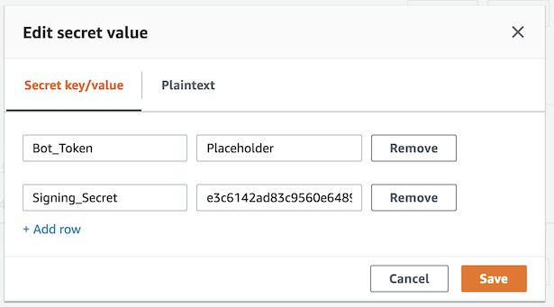
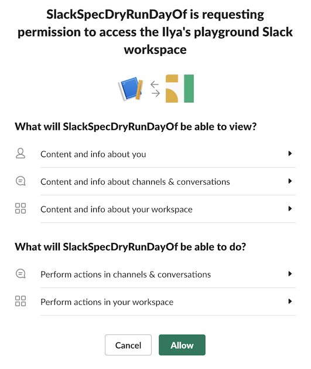

# Module 3: Create a Slack app

#### Background

You will create an application in Slack and make it work with your Serverless Application on AWS. Amazon API Gateway is a managed API service that you will use to subscribe to events from Slack. AWS Secrets Manager is a service to securely store secrets. The app will use two secrets from Slack: 1) the signing secret that enables the app to verify authenticity of events received from Slack and 2) the Bot Token that enables the app to post messages to Slack.

#### High-level instructions

Create a Slack application and set up the necessary permissions and bot user. Copy the signing secret to AWS Secrets Manager. Install the app to your workspace and copy the bot token to AWS Secrets Manager. Copy the API Gateway endpoint from Lambda and use it to subscribe to Slack events - once you paste it, it should be automatically verified. Choose the events you want to subscribe to and re-install the Slack app to your Slack workspace.

#### Step-by-step directions

1. Go to [api.slack.com](https://api.slack.com) and choose **Your apps** in the top right corner.
1. Choose **Create New App**.
1. Give your app a name and choose the development workspace that will own the app. Choose **Create App**.
    
    

1. In the **Basic Information** screen, choose **Permissions**.
1. Scroll down to **Scopes**, choose **chat:write:bot** scope, and choose **Save Changes**.
    
    

1. In the left menu, choose **Bot Users** and choose **Add a Bot User** in the screen that opens.
1. Give your bot a **Display name**, a **Default username**, and choose **Always Show My Bot as Online**. Choose **Add Bot User**.
1. In the left menu, choose **Basic Information** and scroll to the **App Credential** section.
1. In the **Singing Secret** textbox, choose **Show** and copy the secret value.

   

1. Go back to AWS Console, choose **Services** in the navigation, and choose **Secrets Manager** in the list of services.
1. Find the secret named as **APP_NAME-Secret** and choose it.

    

1. Scroll down to the **Secret value** section and choose **Retrieve secret value**.
1. Choose **Edit**.
1. Paste the **Signing secret** you copied in Slack to the textbox next to **Signing_Secret** key. Don't save it yet and keep the tab open.

    

1. Go back to the Slack app configuration page.
1. In the left menu, choose **Install App** and choose **Install App to Workspace**.
1. Choose **Allow** in the following screen.
    
    

1. Copy the **Bot User OAuth Access Token**.

    

1. Go back to the **Secrets Manager** tab.
1. Paste the token you just copied to the textbox next to **Bot_Token** key. Choose **Save**.
1. Choose **Services** in the navigation and and choose **Lambda**.
1. Choose **Applications** in the left menu and click on your application name in the list.
1. Under the **Resources** section, choose **SlackLambdaFunction**.
1. **Lambda** console will open. Choose **API Gateway** under the **Designer** section.
    
    

1. Scroll down until you see the **API Gateway** section and copy the **API endpoint** URL.

    

1. Go back to the Slack app configuration page.
1. In the left menu, choose **Event Subscriptions** and turn **Enable Events** on.
1. Paste the API Gateway endpoint you copied in the Lambda console in step 4 to the **Request URL** textbox and press Enter. You should see a **Verified** label.

    

1. In **Subscribe to Bot Events** section, choose **Add Bot User Event** and select **app_mention** and **message.im**.

    

1. Choose **Save Changes**.    
1. A warning message will appear at the top, requesting the app to be re-installed. Choose **reinstall your app**.

    

1. Choose **Allow** in the app installation screen that opens.

---

### 6. Test!

1. Go to the Slack app and find the bot user you've just added. Send it a message. The bot should echo the message back.

    

1. Add the bot to a channel and send it an @-message. The bot should respond.

    

### :star: Recap

:wrench: You just created an AWS Chatbot bot to connec to your Slack workspace. From here you can easily now build more sophisticated and conversational bots.
### Next

:white_check_mark: Proceed to the next module, [AWS Notifications][notifications], wherein you'll configure AWS to send events to your Slack bot.

---
[cognito]: https://aws.amazon.com/cognito/
[lambda]: https://aws.amazon.com/lambda/
[api-gw]: https://aws.amazon.com/api-gateway/
[s3]: https://aws.amazon.com/s3/
[dynamodb]: https://aws.amazon.com/dynamodb/
[secrets-manager]: https://aws.amazon.com/secrets-manager/
[sns]: https://aws.amazon.com/sns/
[cloudwatch]: https://aws.amazon.com/cloudwatch/
[chatbot]: https://aws.amazon.com/chatbot/
[aws-sam]: https://aws.amazon.com/serverless/sam/
[codepipeline]: https://aws.amazon.com/codepipeline/
[codecommit]: https://aws.amazon.com/codecommit/
[codebuild]: https://aws.amazon.com/codebuild/
[cloudformation]: https://aws.amazon.com/cloudformation/
[aws-console]: https://console.aws.amazon.com
[iam-console]: https://console.aws.amazon.com/iam/home
[lambda-console]: https://console.aws.amazon.com/lambda/home
[cfn-console]: https://console.aws.amazon.com/cloudformation/home
[s3-console]: https://console.aws.amazon.com/s3/home
[chatbot-console]: https://console.aws.amazon.com/chatbot/home
[api-slack]: https://api.slack.com

[setup]: ../00_Setup/
[cleanup]: ../01_Cleanup/
[serverless-app-setup]: ../1_ServerlessAppSetup/
[code-management]: ../2_CodeManagement/
[setup-chatbot]: ../3_ChatBot/
[notifications]: ../4_AWSNotifications/
