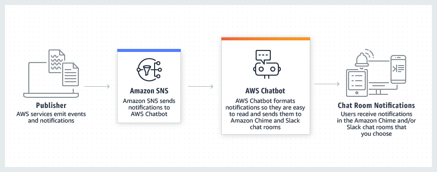
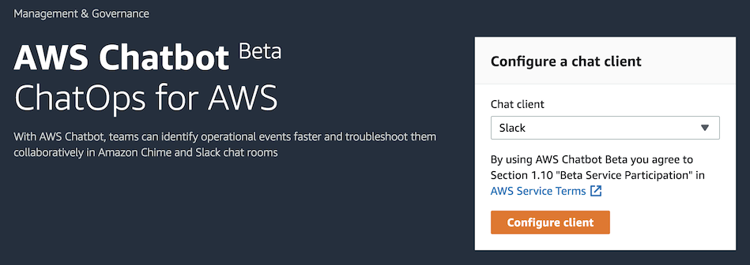
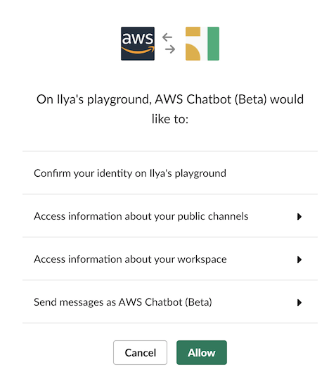
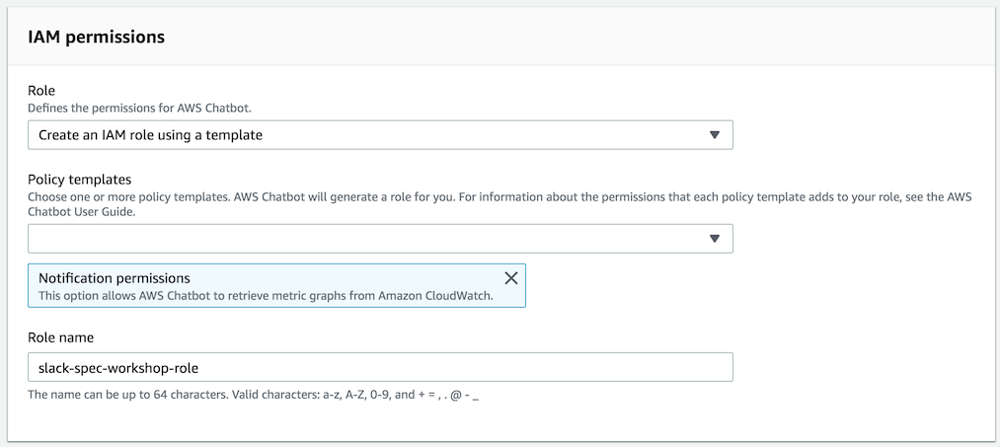
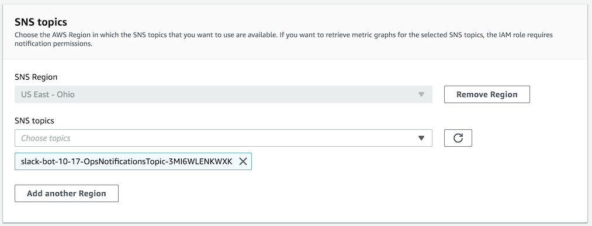
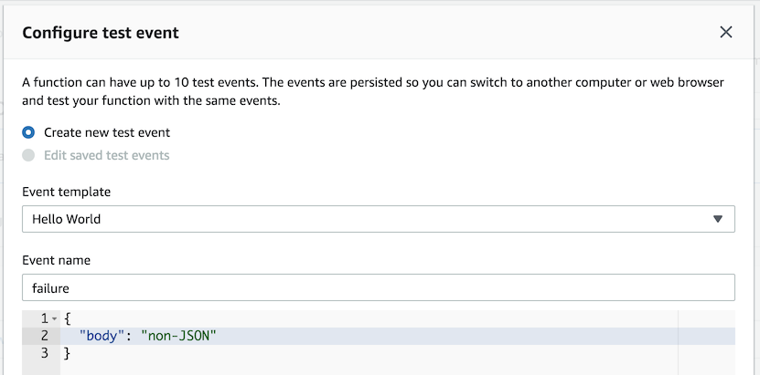
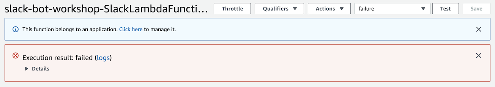
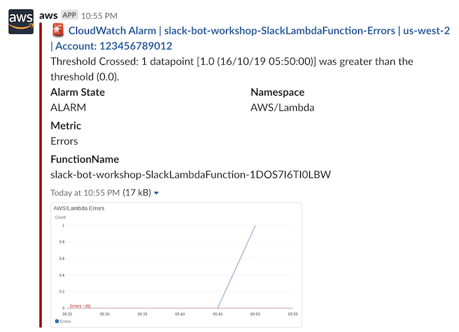

# Module 4: Monitoring the bot with AWS Chatbot

AWS Chatbot enables your team to receive AWS notifications in Slack. To enable notifications, you need to configure the Chatbot with a Slack channel and choose SNS topics that will notify the channel. Then you configure other AWS services to publish notifications to SNS topics and AWS Chatbot will format and deliver notifications to Slack. See [Chatbot documentation][chat-docs] for the list of AWS services integrated with AWS Chatbot.

Your application already includes a CloudWatch Alarm preconfigured to send a notification to an SNS topic when a Lambda function invocation fails.



## Implementation Instructions

:heavy_exclamation_mark: Ensure you've completed the [Slack app setup][setup-chatbot] before beginning this module.

Each of the following sections provides an implementation overview and detailed, step-by-step instructions. The overview should provide enough context for you to complete the implementation if you're already familiar with the AWS Management Console or you want to explore the services yourself without following a walkthrough.

### 1. Configure AWS Chatbot

Configure AWS Chatbot with your Slack workspace. Use the SNS topic that was created by the application.

**:white_check_mark: Step-by-step directions**

1. Go to the [AWS Chatbot console][chatbot-console].
1. In **Configure a chat client**, choose **Slack**, and choose **Configure client**.

    

1. In the next screen, choose **Allow**.

    

1. In the **Configure Slack channel** screen, choose the Slack channel where you want to receive notifications. We recommend creating a new public channel for monitoring the Slack app.
1. Under **IAM permissions**, leave the default settings and give a name to the role.

    

1. Under **SNS topics**, select the region where you created the application (**US East - Ohio**) and choose the SNS topic named **APP_NAME-OpsNotificationsTopic-RANDOM_STRING**. 
1. Choose **Configure**.

    

---

### 2. Test AWS Chatbot notifications

In the Lambda console, create a test event that will guarantee the function to fail. Wait until you receive a CloudWatch Alarm in Slack from AWS Chatbot.

**:white_check_mark: Step-by-step directions**

1. Go back to the [Lambda applications console][lambda-apps] and find the application you created in module 1.
1. Under the **Resources** section, choose **SlackLambdaFunction**.
1. Choose **Test** in the top right corner.
1. In the pop-up form, give the event a name and paste the following snippet into the code editor:

    ```
    {
        "body": "non-JSON"
    }
    ```

    
1. Choose **Create**.
1. Choose **Test** button again.
1. The Lambda function will fail and display a failure message.

    

1. Within a couple of minutes, you will receive a CloudWatch Alarm notification in the Slack channel where you configured AWS Chatbot.

    

### :star: Recap

:wrench: In this module you've configured AWS to send CloudWatch Alarms to your Slack bot.

:star: Congratulations, you have completed the Building Serverless Bots on AWS Workshop! While this was a simple example you could easily extend this to handle further reporting of issues in your infrastructure or in response to events from AWS services.

### Next

:white_check_mark: See this workshop's [cleanup guide][cleanup] for instructions on how to delete the resources you've created.

---
[cognito]: https://aws.amazon.com/cognito/
[lambda]: https://aws.amazon.com/lambda/
[api-gw]: https://aws.amazon.com/api-gateway/
[s3]: https://aws.amazon.com/s3/
[dynamodb]: https://aws.amazon.com/dynamodb/
[secrets-manager]: https://aws.amazon.com/secrets-manager/
[sns]: https://aws.amazon.com/sns/
[cloudwatch]: https://aws.amazon.com/cloudwatch/
[chatbot]: https://aws.amazon.com/chatbot/
[aws-sam]: https://aws.amazon.com/serverless/sam/
[codepipeline]: https://aws.amazon.com/codepipeline/
[codecommit]: https://aws.amazon.com/codecommit/
[codebuild]: https://aws.amazon.com/codebuild/
[cloudformation]: https://aws.amazon.com/cloudformation/
[aws-console]: https://console.aws.amazon.com
[iam-console]: https://console.aws.amazon.com/iam/home
[lambda-console]: https://console.aws.amazon.com/lambda/home
[cfn-console]: https://console.aws.amazon.com/cloudformation/home
[s3-console]: https://console.aws.amazon.com/s3/home
[chatbot-console]: https://console.aws.amazon.com/chatbot/home
[api-slack]: https://api.slack.com
[chat-docs]: https://docs.aws.amazon.com/chatbot/latest/adminguide/related-services.html#related-services.title
[lambda-apps]: https://us-east-2.console.aws.amazon.com/lambda/home?region=us-east-2#/applications

[setup]: ../00_Setup/
[cleanup]: ../01_Cleanup/
[serverless-app-setup]: ../1_ServerlessAppSetup/
[code-management]: ../2_CodeManagement/
[setup-chatbot]: ../3_ChatBot/
[notifications]: ../4_AWSNotifications/
