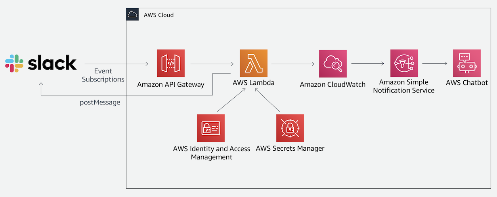

# Building Slack Bots on AWS Workshop

In this workshop, you'll create and deploy a simple Slack application (bot) that echoes back user's messages. The application will include a Slack app connected to a serverless back-end that processes Slack events and publishes messages to Slack.

The application architecture uses [AWS Lambda][lambda], [Amazon API Gateway][api-gw], [AWS Secrets Manager][secrets-manager], [Amazon Simple Notifications Service (SNS)][sns], [Amazon CloudWatch][cloudwatch], and [AWS Chatbot][chatbot]. The Lambda function runs the back-end code that processes events from Slack that it receives via the API Gateway endpoint. Secrets Manager stores the Slack secret that the Lambda function uses to post messages to Slack. Monitoring is done via alarms in CloudWatch that sends state changes to an SNS topic that in turn triggers a notification in Slack through AWS Chatbot.

The infrastructure is orchestrated by a CI/CD pipeline that uses [AWS Serverless Application Model][aws-sam], [AWS CodePipeline][codepipeline], [AWS CodeCommit][codecommit], [AWS CodeBuild][codebuild], and [AWS CloudFormation][cloudformation]. CloudFormation deployment notifications are published to Slack using the SNS topic and AWS Chatbot.

See the diagram below for a depiction of the complete architecture.

---
### Modules

This workshop is divided into four modules. Each module describes a scenario of what we're going to build and step-by-step directions to help you implement the architecture and verify your work.

| Module | Description |
| ---------------- | -------------------------------------------------------- |
| [Serverless App Setup][serverless-app-setup] | Create a new Serverless Application which will support your application and provide CI/CD for it. |
| [Code Management][code-management] | Set up an IAM user for and then clone locally the CodeCommit repository. |
| [Chatbot][setup-chatbot] | Setup an AWS Chatbot to connect with Slack. |
| [AWS Notifications][notifications] | Connect your chat bot back to AWS to recieve notification of events. |

:warning: These modules are intended to be executed linearly.

After you have completed the workshop you can delete all of the resources that were created by following the [cleanup guide][cleanup].

---
[cognito]: https://aws.amazon.com/cognito/
[lambda]: https://aws.amazon.com/lambda/
[api-gw]: https://aws.amazon.com/api-gateway/
[s3]: https://aws.amazon.com/s3/
[dynamodb]: https://aws.amazon.com/dynamodb/
[secrets-manager]: https://aws.amazon.com/secrets-manager/
[sns]: https://aws.amazon.com/sns/
[cloudwatch]: https://aws.amazon.com/cloudwatch/
[chatbot]: https://aws.amazon.com/chatbot/
[aws-sam]: https://aws.amazon.com/serverless/sam/
[codepipeline]: https://aws.amazon.com/codepipeline/
[codecommit]: https://aws.amazon.com/codecommit/
[codebuild]: https://aws.amazon.com/codebuild/
[cloudformation]: https://aws.amazon.com/cloudformation/
[aws-console]: https://console.aws.amazon.com
[iam-console]: https://console.aws.amazon.com/iam/home
[lambda-console]: https://console.aws.amazon.com/lambda/home
[cfn-console]: https://console.aws.amazon.com/cloudformation/home
[s3-console]: https://console.aws.amazon.com/s3/home
[chatbot-console]: https://console.aws.amazon.com/chatbot/home
[api-slack]: https://api.slack.com

[setup]: 00_Setup/
[cleanup]: 01_Cleanup/
[serverless-app-setup]: 1_ServerlessAppSetup/
[code-management]: 2_CodeManagement/
[setup-chatbot]: 3_ChatBot/
[notifications]: 4_AWSNotifications/
