# Building Slack Bots on AWS Workshop

In this workshop, you'll create and deploy a simple Slack application (bot) that echoes back user's messages. The application will include a Slack app connected to a serverless back-end that processes Slack events and publishes messages to Slack.

The application architecture uses [AWS Lambda](https://aws.amazon.com/lambda/), [Amazon API Gateway](https://aws.amazon.com/api-gateway/), [AWS Secrets Manager](https://aws.amazon.com/secrets-manager/), [Amazon Simple Notifications Service (SNS)](https://aws.amazon.com/sns/), [Amazon CloudWatch](https://aws.amazon.com/cloudwatch/), and [AWS Chatbot](https://aws.amazon.com/chatbot/). The Lambda function runs the back-end code that processes events from Slack that it receives via the API Gateway endpoint. Secrets Manager stores the Slack secret that the Lambda function uses to post messages to Slack. Monitoring is done via alarms in CloudWatch that sends state changes to an SNS topic that in turn triggers a notification in Slack through AWS Chatbot.

The infrastructure is orchestrated by a CI/CD pipeline that uses [AWS Serverless Application Model](https://aws.amazon.com/serverless/sam/), [AWS CodePipeline](https://aws.amazon.com/codepipeline/), [AWS CodeCommit](https://aws.amazon.com/codecommit/), [AWS CodeBuild](https://aws.amazon.com/codebuild/), and [AWS CloudFormation](https://aws.amazon.com/cloudformation/). CloudFormation deployment notifications are published to Slack using the SNS topic and AWS Chatbot.

See the diagram below for a depiction of the complete architecture.


## Instructions

Below are the step-by-step directions to help you implement the architecture and verify your work.

### 1. Create a serverless application

#### Background

In this step, you will create a Serverless Application that uses Amazon API Gateway and AWS Lambda to receive and process events. The infrastructure will be orchestrated by an automatically created CI/CD pipeline.

#### High-level instructions

In the Lambda console, create a new serverless application from scratch. Wait until the creation completes.

#### Step-by-step directions

1. Go to [console.aws.amazon.com](https://console.aws.amazon.com) and log in to your AWS account.
1. Choose **US East (Ohio)** region in the navigation bar.

    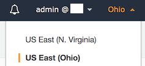

1. Choose **Services** in the navigation bar and find **Lambda** in the list of services.
1. In the Lambda console, choose **Applications** in the sidebar on the left.
1. Choose **Create application**.
1. Choose **Author from scratch** at the bottom of the page.
1. Give the application a name and description, choose **Node.JS 10.x** runtime and **CodeCommit** as the source control service. Give the repository a name. Check the **Create roles and permissions boundary** checkbox. Choose **Create**.

    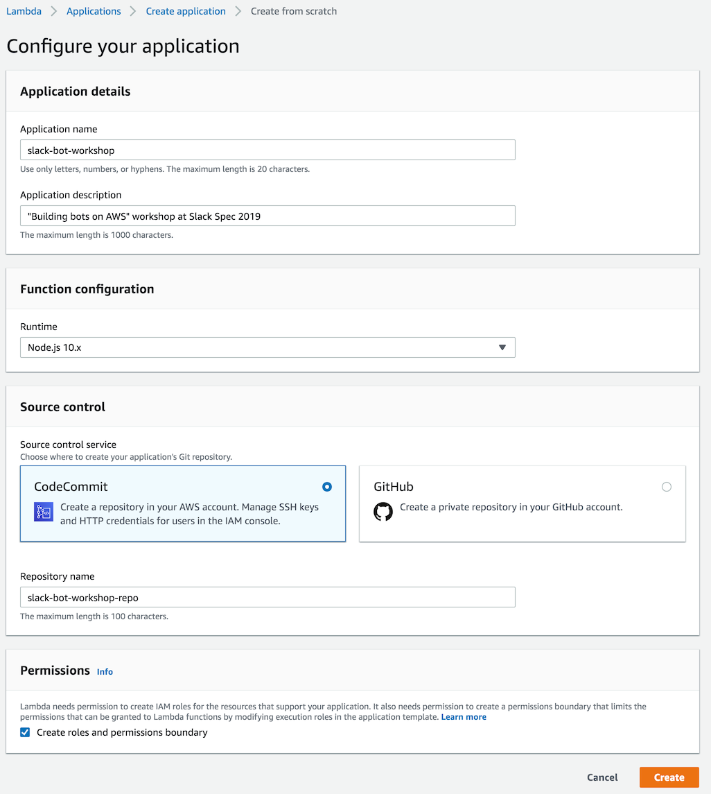

1. Wait for the creation process to finish. This will take approximately 5 minutes and you will see a success message when it's complete.

---

### 2. Add permissions to CloudFormation

#### Background

Creation of infrastructure for the application is done by AWS CloudFormation, a service that enables managing infrastructure as code (IaC). CloudFormation uses an Identity and Access Management (IAM) role to create resources in your account. The default role created by the Serverless Application template does not have sufficient permissions to create resources in CloudWatch, SNS and IAM that you will need for this workshop. In this step, you will manually add the necessary permissions.

#### High-level instructions

Open the CloudFormationRole IAM role in IAM console and add SNSFullAccess, IAMFullAccess, and CloudWatchFullAccess policies to it.

#### Step-by-step directions

1. In the Application page, choose **CloudFormationRole** under the **Infrastructure** section.
1. **Identity and Access Management** console will open in a new tab.
1. Choose **Attach policies**.
1. Search for **SNSFullAccess** and select it (but do not attach it yet). Repeat for **IAMFullAccess** and **CloudWatchFullAccess**.
    
    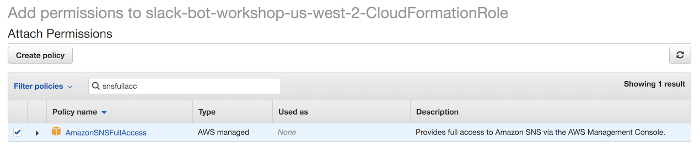

1. Choose **Attach policy** to attach the three selected policies to the role.
1. Don't close the **IAM** tab, you'll need it for the next step.

---

### 3. Create AWS CodeCommit credentials

#### Background

The application uses AWS CodeCommit as a code repository. In order to use Git to push code to your application's repository, you need AWS CodeCommit credentials.

#### High-level instructions

Create an IAM user with CodeCommitFullAccess permissions, generate Git credentials and save them to a safe place on your computer.

#### Step-by-step directions

1. In the **IAM** console, choose **Users** in the left sidebar.
1. Choose **Add user**.
1. Give the user a name, e.g. **CodeCommitUser** and choose **Programmatic access**.

    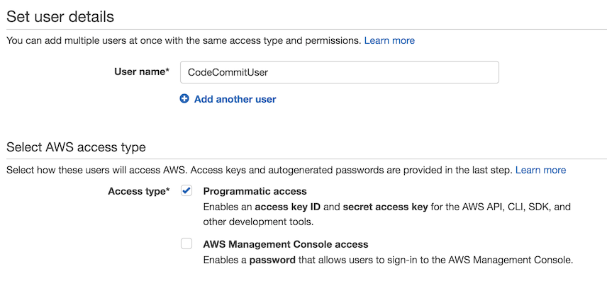

1. Choose **Next: Permissions**
1. Choose **Attach existing policies directly**.
1. Search for **CodeCommitFullAccess** and select the checkbox next to the policy.

    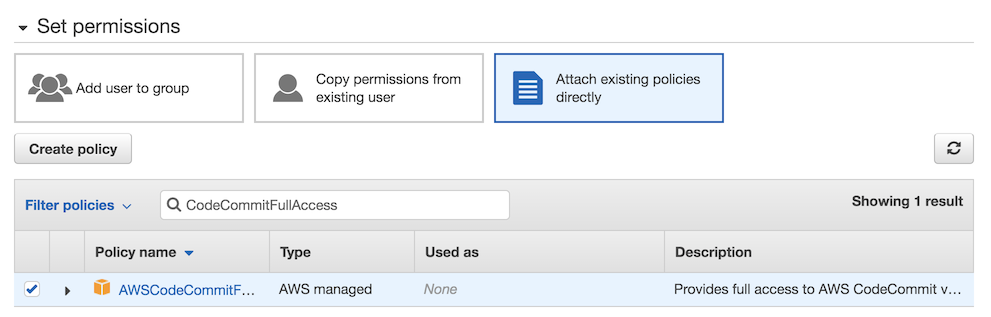

1. Choose **Next: Tags**.
1. Choose **Next: Review**.
1. Choose **Create user**.
1. Choose **Close**.
1. You will be redirected back to the **Users** page in IAM. Find the user you've just created.

    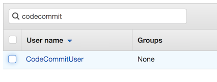

1. Click on the user name.
1. Choose the **Security credentials** tab.
1. Under **HTTPS Git credentials for AWS CodeCommit**, choose **Generate Git credentials**.
1. Choose **Download credentials** or save username and password to a safe location on your computer.

    
1. You can close the **IAM** tab now.

---

### 4. Set up a local CodeCommit repository and update the app code

#### Background

In step 1, you created a simple "hello world" application from a template. In this step, you will add the new Serverless Application Model (SAM) template and the slack bot code to the repository. This will create additional AWS resources and deploy the Slack bot code to a Lambda function.

#### High-level instructions

Clone the AWS CodeCommit repository, add a remote branch with the slack bot code, and push the slack bot code to CodeCommit. Verify that the code successfully goes through the pipeline and deploys.

#### Step-by-step directions

1. Go back to the tab with the application you created in step 1.
1. Under the **Infrastructure** section, choose **ProjectPipeline**.
1. **CodePipeline** console will open in a new tab.
1. Choose **AWS CodeCommit** under the **Source** stage.

    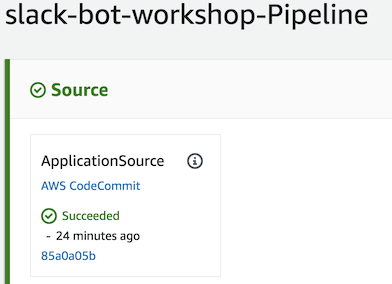

1. The code repository managed by AWS CodeCommit will open in the same tab.
1. Choose **Clone URL** and select **Clone HTTPS** in the dropdown.
1. You can see the clone URL in the success message at the top of the page. The URL has been automatically copied to the clipboard.
1. Open the terminal app on your computer and go to the directory where you want to store the code.
1. Type the following command 
    ```
    git clone <URL>
    ```
1. You will be prompted for a user name and password. Use the CodeCommit credentials you saved in step 2.

    **If you got an error**: If you've previously configured aws credential helper for git, you may get a "repository not found" error. You will need to remove or comment (with a `#`) the following line in .gitconfig file (`~/.gitconfig` on Mac/Linux, `C:\Users\<USER>\.gitconfig` on Windows):
    ```
    helper = !aws --global codecommit credential-helper $@
    ```
1. Run the following commands in the terminal to get the Slack bot code added to your code repository.
    ```
    cd <NAME-OF-REPOSITORY>
    git remote add gh-origin https://github.com/aws-samples/building-bots-on-aws.git
    git fetch gh-origin
    git merge gh-origin/master --strategy-option theirs --allow-unrelated-histories -m "Merge from github"
    git push origin master
    ```
1. Go back to application tab in the AWS Console and choose **ProjectPipeline**.
1. **CodePipeline** console will open a new tab. Watch the code go through the pipeline until all three stages (Source, Build, Deploy) succeed. This will take about 5-7 minutes.

    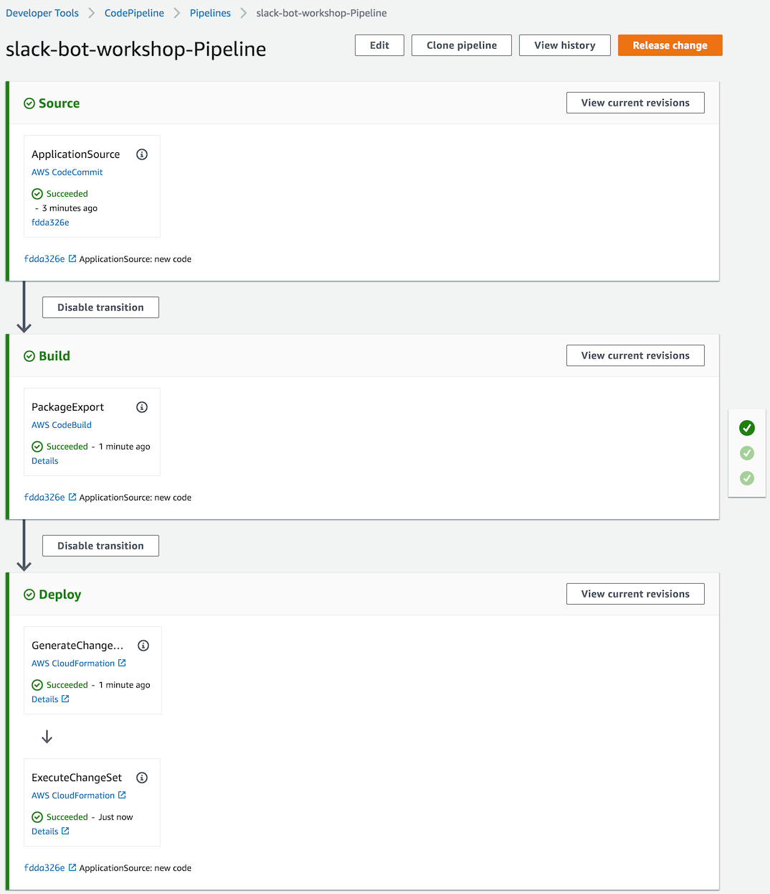

---

### 5. Create a Slack app

#### Background

You will create an application in Slack and make it work with your Serverless Application on AWS. Amazon API Gateway is a managed API service that you will use to subscribe to events from Slack. AWS Secrets Manager is a service to securely store secrets. The app will use two secrets from Slack: 1) the signing secret that enables the app to verify authenticity of events received from Slack and 2) the Bot Token that enables the app to post messages to Slack.

#### High-level instructions

Create a Slack application and set up the necessary permissions and bot user. Copy the signing secret to AWS Secrets Manager. Install the app to your workspace and copy the bot token to AWS Secrets Manager. Copy the API Gateway endpoint from Lambda and use it to subscribe to Slack events - once you paste it, it should be automatically verified. Choose the events you want to subscribe to and re-install the Slack app to your Slack workspace.

#### Step-by-step directions

1. Go to [api.slack.com](https://api.slack.com) and choose **Your apps** in the top right corner.
1. Choose **Create New App**.
1. Give your app a name and choose the development workspace that will own the app. Choose **Create App**.
    
    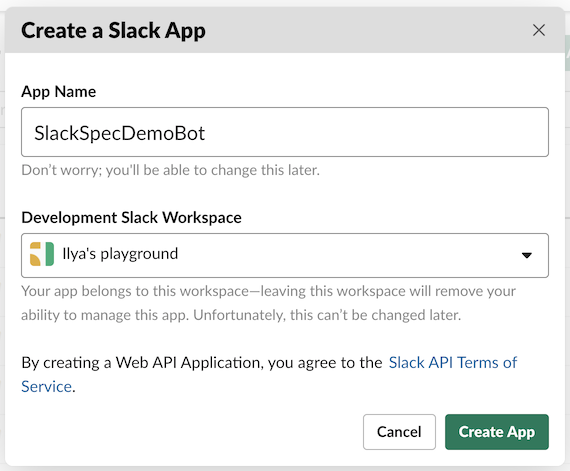

1. In the **Basic Information** screen, choose **Permissions**.
1. Scroll down to **Scopes**, choose **chat:write:bot** scope, and choose **Save Changes**.
    
    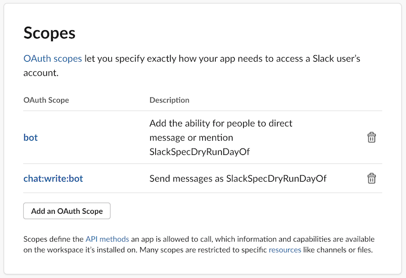

1. In the left menu, choose **Bot Users** and choose **Add a Bot User** in the screen that opens.
1. Give your bot a **Display name**, a **Default username**, and choose **Always Show My Bot as Online**. Choose **Add Bot User**.
1. In the left menu, choose **Basic Information** and scroll to the **App Credential** section.
1. In the **Singing Secret** textbox, choose **Show** and copy the secret value.

   

1. Go back to AWS Console, choose **Services** in the navigation, and choose **Secrets Manager** in the list of services.
1. Find the secret named as **APP_NAME-Secret** and choose it.

    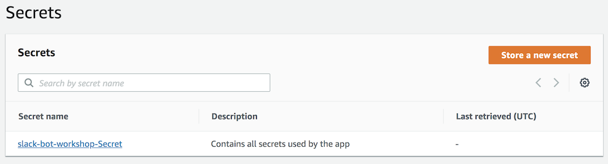

1. Scroll down to the **Secret value** section and choose **Retrieve secret value**.
1. Choose **Edit**.
1. Paste the **Signing secret** you copied in Slack to the textbox next to **Signing_Secret** key. Don't save it yet and keep the tab open.

    

1. Go back to the Slack app configuration page.
1. In the left menu, choose **Install App** and choose **Install App to Workspace**.
1. Choose **Allow** in the following screen.
    
    

1. Copy the **Bot User OAuth Access Token**.

    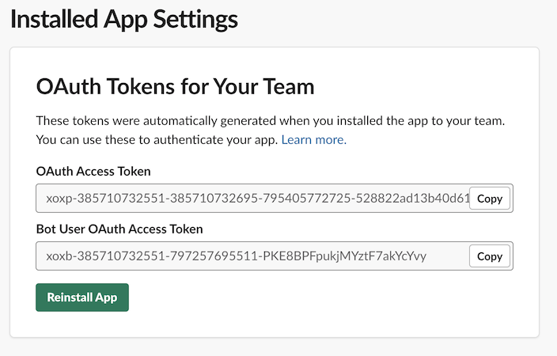

1. Go back to the **Secrets Manager** tab.
1. Paste the token you just copied to the textbox next to **Bot_Token** key. Choose **Save**.
1. Choose **Services** in the navigation and and choose **Lambda**.
1. Choose **Applications** in the left menu and click on your application name in the list.
1. Under the **Resources** section, choose **SlackLambdaFunction**.
1. **Lambda** console will open. Choose **API Gateway** under the **Designer** section.
    
    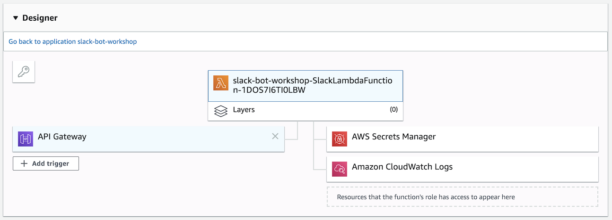

1. Scroll down until you see the **API Gateway** section and copy the **API endpoint** URL.

    

1. Go back to the Slack app configuration page.
1. In the left menu, choose **Event Subscriptions** and turn **Enable Events** on.
1. Paste the API Gateway endpoint you copied in the Lambda console in step 4 to the **Request URL** textbox and press Enter. You should see a **Verified** label.

    

1. In **Subscribe to Bot Events** section, choose **Add Bot User Event** and select **app_mention** and **message.im**.

    

1. Choose **Save Changes**.    
1. A warning message will appear at the top, requesting the app to be re-installed. Choose **reinstall your app**.

    

1. Choose **Allow** in the app installation screen that opens.

---

### 6. Test!

1. Go to the Slack app and find the bot user you've just added. Send it a message. The bot should echo the message back.

    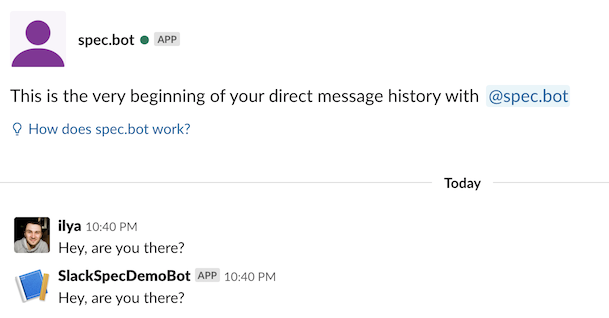

1. Add the bot to a channel and send it an @-message. The bot should respond.

    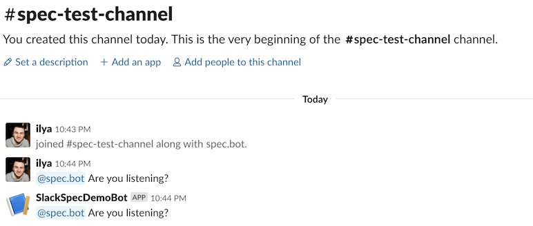

---

### 7. Monitoring the bot with AWS Chatbot

#### Background

AWS Chatbot enables your team to receive AWS notifications in Slack. To enable notifications, you need to configure the Chatbot with a Slack channel and choose SNS topics that will notify the channel. Then you configure other AWS services to publish notifications to SNS topics and AWS Chatbot will format and deliver notifications to Slack. See [Chatbot documentation](https://docs.aws.amazon.com/chatbot/latest/adminguide/related-services.html#related-services.title) for the list of AWS services integrated with AWS Chatbot.

Your application already includes a CloudWatch Alarm preconfigured to send a notification to an SNS topic when a Lambda function invocation fails.

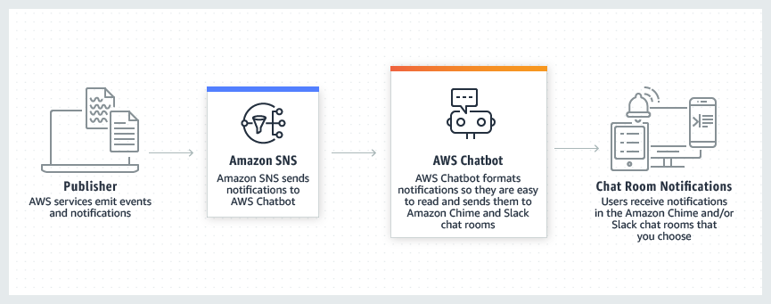

#### High-level instructions

Configure AWS Chatbot with your Slack workspace. Use the SNS topic that was created by the application.

#### Step-by-step directions

1. Go to AWS Console, choose **Services** in the navigation, and choose **AWS Chatbot** in the list of services.
1. In **Configure a chat client**, choose **Slack**, and choose **Configure client**.

    

1. In the next screen, choose **Allow**.

    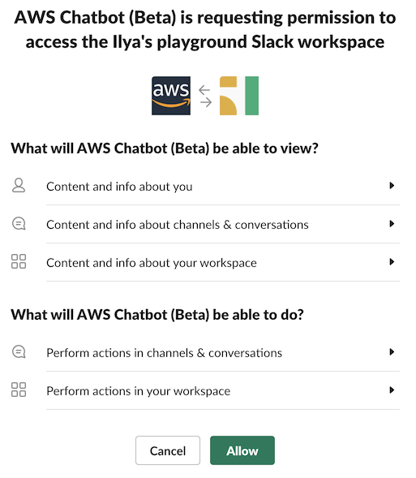

1. In the **Configure Slack channel** screen, choose the Slack channel where you want to receive notifications. We recommend creating a new public channel for monitoring the Slack app.
1. Under **IAM permissions**, leave the default settings and give a name to the role.

    

1. Under **SNS topics**, select the region where you created the application (**US East - Ohio**) and choose the SNS topic named **APP_NAME-OpsNotificationsTopic-RANDOM_STRING**. Choose **Configure**.

    

---

### 8. Test AWS Chatbot notifications

#### Background

To test the AWS Chatbot notifications, you will cause the Lambda function to fail and trigger a CloudWatch Alarm.

#### High-level instructions

In the Lambda console, create a test event that will guarantee the function to fail. Wait until you receive a CloudWatch Alarm in Slack from AWS Chatbot.

#### Step-by-step directions

1. Choose **Services** in the navigation and and choose **Lambda**.
1. Choose **Applications** in the left menu and click on your application name in the list.
1. Under the **Resources** section, choose **SlackLambdaFunction**.
1. Choose **Test** in the top right corner.
1. In the pop-up form, give event an **Event name**, paste the following snippet into the code editor, and choose **Create**.

    ```
    {
        "body": "non-JSON"
    }
    ```

    

1. Choose **Test** button again.
1. The Lambda function will fail and display a failure message.

    

1. Within a couple of minutes, you will receive a CloudWatch Alarm notification in the Slack channel where you configured AWS Chatbot.

    

---

This marks completion of the workshop.